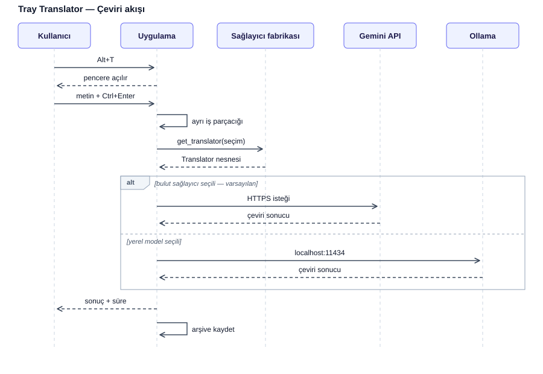

# Tray Translator

Masaüstünde arka planda çalışan, kısayolla çağrılan İngilizce → Türkçe çeviri aracı. Çeviriyi ister bilgisayarda yerel olarak çalışan bir dil modeliyle, ister bulut API'si üzerinden yapar.

Python ve AI/agent geliştirme öğrenmek amacıyla adım adım geliştirilmiştir.

## Ne yapar

Uygulama sistem tepsisinde sessizce bekler. `Alt+T` tuşuna bastığında pencere açılır; metni yapıştırır, `Ctrl+Enter` ile çevirir, sonucu kopyalarsın. Aynı kısayol pencereyi geri gizler.

Model seçim kutusundan iki sağlayıcı arasında geçiş yapılabilir: Yerel Ollama modeli ve bir bulut modeli. Sağlayıcı değiştirmek uygulamayı yeniden başlatmayı gerektirmez.

## Ekran görüntüsü

Ekran görüntüsü ileride eklenecek.

## Özellikler

- Arka planda çalışma, sistem tepsisi ikonu; Windows açılışında başlatma elle ayarlanır ([aşağıda](#windows-açılışında-başlatma))
- Global kısayol (`Alt+T`) ile aç/gizle
- Yerel (offline) ve bulut sağlayıcılar arasında anlık geçiş
- Terim sözlüğü: belirlenen terimlerin karşılıkları modele dayatılır
- Çeviri süresi ölçümü ve günlük arşiv kaydı
- Tek örnek koruması: ikinci kez çalıştırıldığında yeni örnek açılmaz
- İptal edilebilir çeviri: `Esc` veya pencereyi kapatmak devam eden isteği iptal eder; küçültme etmez
- Konsolsuz çalışmada hataların dosyaya kaydedilmesi

## Gereksinimler

- Windows 10 / 11
- [Git](https://git-scm.com) (depoyu indirmek için; ZIP olarak indirecekseniz gerekmez)
- [uv](https://docs.astral.sh/uv/) (Python'u ve paketleri o kurar)
- Python 3.13 veya üstü (bilgisayarda yoksa uv kendisi indirir)
- [Ollama](https://ollama.com) (yerel çeviri için)
- Google AI Studio API anahtarı (bulut çeviri için, isteğe bağlı)

Python paketleri `pyproject.toml` içinde tanımlı, tam sürümleri `uv.lock` içinde kilitlidir:

```
PySide6
pynput
pyinstaller   (yalnızca .exe derlemek için, geliştirme bağımlılığı)
```

## Kurulum

**0. Gerekli araçları kur**

Kurulu olanları atlayın:

```powershell
winget install --id=Git.Git -e
winget install --id=astral-sh.uv -e
winget install --id=Ollama.Ollama -e
```

Kurulumdan sonra terminali yeniden açın ve doğrulayın:

```powershell
git --version
uv --version
ollama --version
```

Ollama yalnızca yerel çeviri için gerekir; sadece bulut sağlayıcıyı kullanacaksanız kurmayabilirsiniz. Diğer kurulum yolları için [uv belgelerine](https://docs.astral.sh/uv/getting-started/installation/) ve [ollama.com](https://ollama.com) adresine bakın.

**1. Depoyu al ve ortamı kur**

```powershell
git clone https://github.com/CodeByOktay/tray-translator.git
cd tray-translator
uv sync
```

Git kullanmak istemiyorsanız GitHub sayfasındaki **Code → Download ZIP** ile indirip klasörü açın ve içinde `uv sync` çalıştırın.

`uv sync`, proje klasöründe bir `.venv` oluşturur ve kilit dosyasındaki sürümleri kurar. Ortamı elle etkinleştirmek gerekmez; komutlar `uv run` ile çalıştırılır.

**2. Yerel modeli indir**

Yerel çeviri için Ollama'da kurulu herhangi bir model kullanılabilir; seçim size kalmış. Önerilen ve varsayılan model `gemma3:1b` (küçük ve hızlı):

```powershell
ollama pull gemma3:1b
```

Başka bir model kullanmak için onu indirin ve adını `OLLAMA_MODEL` ortam değişkenine yazın:

```powershell
ollama pull <model-adı>
[Environment]::SetEnvironmentVariable("OLLAMA_MODEL", "<model-adı>", "User")
```

Değişken tanımlı değilse `gemma3:1b` kullanılır. Seçilen model, penceredeki model kutusunda `Local - <model-adı>` olarak görünür. Değişikliğin geçerli olması için terminali ve uygulamayı yeniden başlatın.

**3. Bulut sağlayıcı için API anahtarı tanımla (isteğe bağlı)**

`aistudio.google.com` adresinden anahtar al ve ortam değişkeni olarak tanımla:

```powershell
[Environment]::SetEnvironmentVariable("GEMINI_API_KEY", "anahtarınız", "User")
```

Değişkenin okunabilmesi için terminali ve editörü yeniden başlatın.

Anahtar yalnızca bu ortam değişkeninden okunur; koda ya da depodaki bir dosyaya yazılmaz. Anahtar tanımlı değilse yerel (Ollama) sağlayıcı yine çalışır.

Hangi Gemini modelinin kullanılacağı size kalmış. Önerilen ve varsayılan model `gemini-3.6-flash`; başka bir model için adını `GEMINI_MODEL` ortam değişkenine yazın:

```powershell
[Environment]::SetEnvironmentVariable("GEMINI_MODEL", "<model-adı>", "User")
```

**4. Çalıştır**

```powershell
uv run main.py
```

Uygulama açıldığında model kutusunda bulut sağlayıcı (`Cloud - <model-adı>`) seçili gelir. API anahtarı tanımlamadıysanız çeviri "GEMINI_API_KEY ortam degiskeni bulunamadi" hatası verir; kutudan `Local - <model-adı>` seçeneğini seçin.

Konsol penceresi istemiyorsanız:

```powershell
uv run pythonw main.py
```

## .exe derleme

Derlenmiş `.exe` depoda bulunmaz; kaynak koddan PyInstaller ile üretilir:

```powershell
uv run pyinstaller tray-translator.spec
```

Çıktı `dist\tray-translator\` klasörüne yazılır; çalıştırılacak dosya `dist\tray-translator\tray-translator.exe`. Klasörün tamamı birlikte taşınmalıdır (`_internal` klasörü `.exe` için gereklidir). Paketlenmiş uygulama `logs` ve `gecmis` klasörlerini `.exe` dosyasının yanında oluşturur.

## Kurulumdan sonra

**Sistem tepsisi.** Ayrı bir ayar gerekmez; uygulama çalıştığında tepsiye yerleşir (mavi kare içinde "TR" ikonu) ve bir bildirim gösterir. İkon görünmüyorsa Windows onu gizli simgeler (`^`) altına almıştır. Hep görünmesi için: Ayarlar → Kişiselleştirme → Görev çubuğu → Diğer sistem tepsisi simgeleri (Windows 10'da "Görev çubuğunda görünecek simgeleri seçin").

**Ortam değişkenleri.** Hiçbiri zorunlu değildir; tanımlandıktan sonra terminali ve uygulamayı yeniden başlatın.

| Değişken | Ne işe yarar | Tanımlı değilse |
|---|---|---|
| `GEMINI_API_KEY` | Bulut çevirisi için API anahtarı | Bulut sağlayıcı hata verir, yerel sağlayıcı çalışır |
| `OLLAMA_MODEL` | Yerel çeviride kullanılacak Ollama modeli | `gemma3:1b` |
| `GEMINI_MODEL` | Bulut çevirisinde kullanılacak Gemini modeli | `gemini-3.6-flash` |

Bir değişkenin tanımlı olup olmadığına bakmak için:

```powershell
[Environment]::GetEnvironmentVariable("OLLAMA_MODEL", "User")
```

**Ollama.** Yerel çeviri için Ollama arka planda çalışıyor olmalıdır. `ollama list` kurulu modelleri gösteriyorsa çalışıyordur.

### Windows açılışında başlatma

Uygulama kendini açılışa eklemez; Windows'un Başlangıç klasörüne bir kısayol koyarak elle yapılır:

1. `.exe` dosyasını derleyin (yukarıdaki [.exe derleme](#exe-derleme) bölümü).
2. `Win+R` tuşlarına basın, `shell:startup` yazıp Enter'a basın; Başlangıç klasörü açılır.
3. `dist\tray-translator\tray-translator.exe` dosyasına sağ tıklayıp kısayol oluşturun ve kısayolu bu klasöre taşıyın.

Kaldırmak için kısayolu silmek yeterlidir. `.exe` klasörü taşınırsa kısayol yeniden oluşturulmalıdır.

### Sorun giderme

- Konsolsuz çalışmada hatalar `logs\hata.log` dosyasına yazılır. Hatayı doğrudan görmek için `uv run main.py` ile konsollu çalıştırın.
- Uygulama açılmıyor gibi görünüyorsa zaten çalışıyor olabilir: ikinci kez başlatıldığında yeni örnek açmaz, var olan pencereyi öne getirir. Tepsiye bakın.
- "Ollama'ya baglanilamadi" hatasında Ollama'yı başlatın; "GEMINI_API_KEY ortam degiskeni bulunamadi" hatasında anahtarı tanımlayın ya da model kutusundan yerel modeli seçin.
## Kullanım

| İşlem | Kısayol |
|---|---|
| Pencereyi aç / gizle | `Alt+T` |
| Çevir | `Ctrl+Enter` |
| Çeviriyi iptal et ve kapat | `Esc` |
| Uygulamadan çık | Tepsi ikonu → sağ tık → Çıkış |

Pencereyi küçültmek devam eden çeviriyi iptal etmez; kapatmak eder.

## Proje yapısı

```
tray-translator/
├── engine.py        Ollama'ya istek atan çeviri çekirdeği, sistem istemi, terim sözlüğü
├── providers.py     Sağlayıcı soyutlaması: Ollama ve Gemini sınıfları, fabrika fonksiyonu
├── window.py        PySide6 arayüzü, arka plan iş parçacığı
├── main.py          Giriş noktası: tepsi ikonu, global kısayol, tek örnek koruması
├── logsetup.py      Yakalanmamış hataları dosyaya yazan günlük sistemi
├── paths.py         Paketlenmiş ve paketlenmemiş çalışmada doğru klasör yolları
├── pyproject.toml   Proje tanımı ve bağımlılıklar
├── uv.lock          Kilitlenmiş bağımlılık sürümleri
├── tray-translator.spec  PyInstaller derleme tarifi
├── docs/            Mimari çizimi
├── logs/            Teknik kayıtlar (hata.log)
└── gecmis/          Çeviri arşivi (cikti_YYYY-MM-DD.txt) (Terminalden çalıştırılanları içerir.Terminalden çalıştırmadığında arşiv kaydı yapılmaz.)
```

`logs/` ve `gecmis/` depoda yer almaz; uygulama ilk çalıştığında kendisi oluşturur.

## Mimari




Sistem dört katmandan oluşur:

**Arayüz katmanı** (`window.py`, `main.py`) — metni alır, sonucu gösterir. Çeviriyi kimin yaptığını bilmez.

**Sağlayıcı katmanı** (`providers.py`) — `Translator` protokolü, tüm sağlayıcıların uyduğu tek sözleşmedir. Yeni bir sağlayıcı eklemek için protokole uyan bir sınıf yazmak ve `PROVIDERS` sözlüğüne bir satır eklemek yeterlidir; başka hiçbir dosyaya dokunulmaz.

**Model katmanı** — Ollama yerel sunucusu (`localhost:11434`) veya Gemini API'si.

**Bilgi katmanı** — terim sözlüğü, çeviri arşivi, hata günlüğü.

Çeviri uzun sürdüğü için ayrı bir `QThread` içinde çalışır; arayüz bu sırada donmaz. Arka plandaki iş parçacıkları arayüz nesnelerine doğrudan dokunmaz, sinyal yayınlar.

## Model karşılaştırması

Aynı test metinleriyle yapılan ölçümler:

| Model | Süre | Değerlendirme |
|---|---|---|
| `gemma3:1b` | ~5 sn | Hızlı, ancak sözcük hataları ve bozuk cümle kurulumu |
| `gemma3:4b` | ~25 sn | Belirgin şekilde daha doğru, ancak donanım kısıtı nedeniyle yavaş |
| Gemini Flash | ~2 sn | En tutarlı sonuç; internet bağlantısı gerektirir |

`gemma3:1b` modelinde gözlenen hata türleri üç başlıkta toplanabilir: talimat takibi zayıflığı (bazı kelimelerin hiç çevrilmemesi), sözcük bilgisi eksikliği (yanlış karşılık seçimi) ve bağlam tutarsızlığı (uzun cümlelerin sonuna doğru anlamın kayması).

## Bilinen sınırlar

**Donanım kısıtı.** Test edilen sistemde 4 GB ekran kartı belleği bulunuyor; `gemma3:4b` modeli 3.8 GB olduğu için karta tam sığmıyor ve yaklaşık yarısı işlemcide çalışıyor. Bağlam penceresini küçültmek (`num_ctx: 2048`) ölçülebilir bir kazanç sağlamadı. Bulut sağlayıcının plana eklenmesinin asıl gerekçesi bu ölçümdür.

**Model bellekte kalma süresi.** `keep_alive: 30m` ayarı sayesinde model son çeviriden sonra yarım saat bellekte tutulur. Bu süre dolduktan sonraki ilk çeviri, modelin yeniden yüklenmesi nedeniyle belirgin şekilde yavaştır.

**Kısayol çakışması.** `Alt+T` kombinasyonu tuş vuruşlarını yutmaz; odaktaki uygulamada bir menü kısayolu olarak da yorumlanabilir.

**İptal davranışı.** Devam eden bir ağ isteği gerçekten durdurulamaz. İptal edildiğinde arayüz hemen serbest bırakılır, dönen sonuç sessizce yok sayılır.

**Veri gizliliği.** Gemini'nin ücretsiz katmanında gönderilen içerik servis sağlayıcı tarafından model geliştirmek amacıyla kullanılabilir. Hassas metinler için yerel model tercih edilmelidir.

## Geliştirme aşamaları

1. Çeviri çekirdeği ve terminal arayüzü
2. PySide6 penceresi ve arka plan iş parçacığı
3. Global kısayol, sistem tepsisi, tek örnek koruması
4. Sağlayıcı soyutlaması ve bulut entegrasyonu

## Lisans

Bu proje MIT lisansı ile yayınlanmıştır. Ayrıntılar için [LICENSE](LICENSE) dosyasına bakın.
